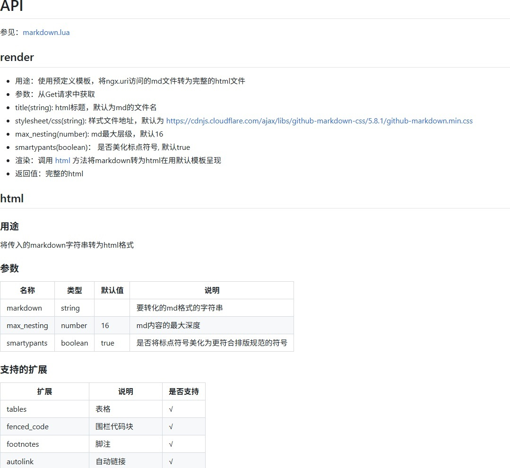

# lua-resty-markdown
通过ffi调用[hoedown](https://github.com/hoedown/hoedown)将markdown转为html的Openresty的module  
本项目代码大量从[hoedown](https://github.com/hoedown/hoedown) 和 [lua-resty-hoedown](https://github.com/bungle/lua-resty-hoedown) 拷贝而来

# 应用
1. 在Openresty的conf中配置markdown转html
```conf
    location ~ \.md$ {
        # 因长度会变化，所以去除content_length，由nginx自动计算
        header_filter_by_lua_block {
            ngx.header.content_length = nil
            ngx.header.content_type = "text/html"
        }
        # 使用预定义模板将md转为完整的html文件
        body_filter_by_lua_block {
            ngx.arg[1] = require("resty.markdown").render()
        }
    }
```
2. 访问：http://yourwebsite.com/README.md
3. 返回预定义模板呈现的html,显示如下 
    

# 安装
因本项目包含C代码，不能用OPM命令安装，需编译安装(无任何依赖)
1. 安装[openresty](https://openresty.org/en/installation.html)
2. `git clone https://github.com/sssxyd/lua-resty-markdown.git`
3. `cd lua-resty-markdown`
4. Makefile(ubuntu&&centos已验证)：
    ```shell
    make
    sudo make install
    sudo openresty -s reload
    # 不报错则安装成功
    sudo resty -e "require 'resty.markdown'"
    ```
5. CMake
    ```shell
    mkdir build
    cd build
    cmake ..
    make
    sudo make install
    sudo openresty -s reload
    # 不报错则安装成功
    sudo resty -e "require 'resty.markdown'"    
    ```

# API
参见：[markdown.lua](lib/resty/markdown.lua)

## render
- 用途：使用预定义模板，将ngx.uri访问的md文件转为完整的html文件
- 参数：从Get请求中获取
- title(string): html标题，默认为md的文件名
- stylesheet/css(string): 样式文件地址，默认为 https://cdnjs.cloudflare.com/ajax/libs/github-markdown-css/5.8.1/github-markdown.min.css
- max_nesting(number): md最大层级，默认16
- smartypants(boolean)： 是否美化标点符号, 默认true
- 渲染：调用 html 方法将markdown转为html在用默认模板呈现
- 返回值：完整的html

## html
### 用途
将传入的markdown字符串转为html格式
### 参数
| 名称 | 类型 | 默认值 | 说明 |
| ---- | ---- | ---- | ---- |
| markdown | string | | 要转化的md格式的字符串 |
| max_nesting | number | 16 | md内容的最大深度 |
| smartypants | boolean | true | 是否将标点符号美化为更符合排版规范的符号|
### 支持的扩展
| 扩展 | 说明 | 是否支持 |
| ---- | ---- | ---- |
| tables | 表格 | √ |
| fenced_code | 围栏代码块 |  √ |
| footnotes | 脚注 | √ |
| autolink | 自动链接 | √ |
| strikethrough | 删除线 | √ |
| underline | 下划线 | √ |
| highlight | 高亮 | √ |
| quote | 引用 | √ |
| superscript | 上标 | √ |
| math | 数学公式 | √ |
| no_intra_emphasis | 禁用单次内部强调 | √ |
| space_headers | 空格标题 | √ |
| math_explicit | 显示数学公式 | √ |
| disable_indented_code | 禁用缩进代码块 | √ |
### 返回值
转换后的html代码块

## toc
### 用途
从markdown中提取目录，并转为html格式
### 参数
| 名称 | 类型 | 默认值 | 说明 |
| ---- | ---- | ---- | ---- |
| markdown | string | | 要转化的md格式的字符串 |
| max_nesting | number | 16 | md内容的最大深度 |
| toc_nesting | number | 6 | 最大目录层级 |
| smartypants | boolean | true | 是否将标点符号美化为更符合排版规范的符号|
### 返回值
仅包含目录的html代码块

## hoedown
### 用途
自定义配置如何转换markdown
### 参数
| 名称 | 类型 | 默认值 | 说明 |
| ---- | ---- | ---- | ---- |
| source | string | | 要转化的md格式的字符串 |
| opts | table |  | 选项列表 |
| opts.renderer | string | | 转换方法，取值为：html/html.toc |
| opts.extensions | table |  | 支持的扩展特性列表 |
| opts.max_nesting | number |  | md内容的最大深度 |
| opts.smartypants | boolean |  | 是否将标点符号美化为更符合排版规范的符号 |
| opts.nesting | number |  | 最大目录层级 |
### 返回值
转换后的html代码块